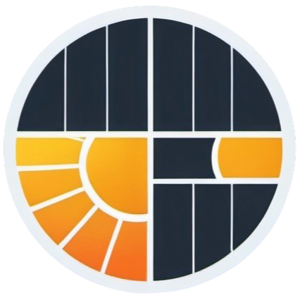
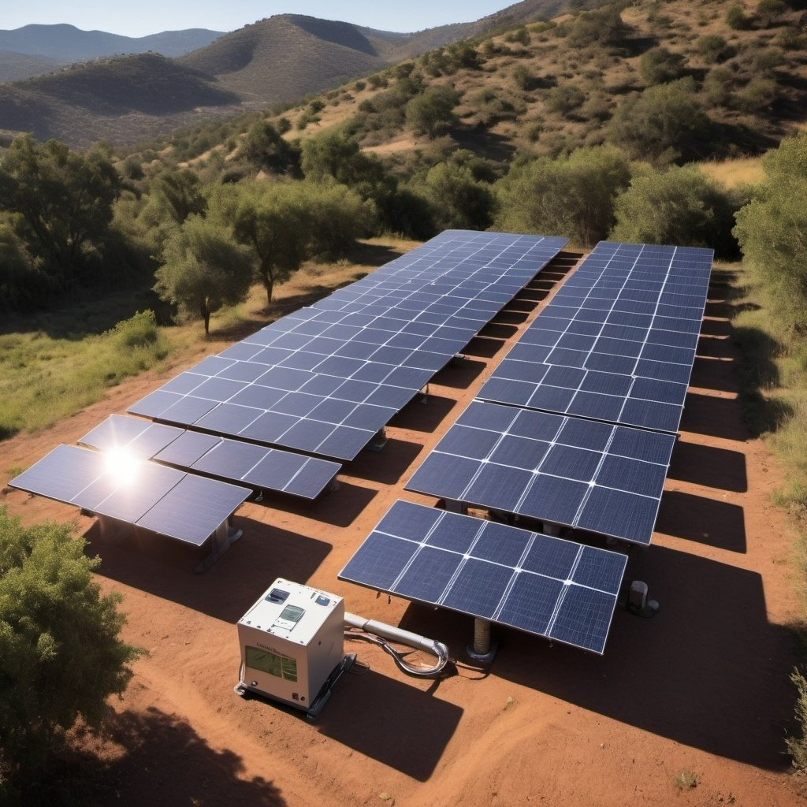
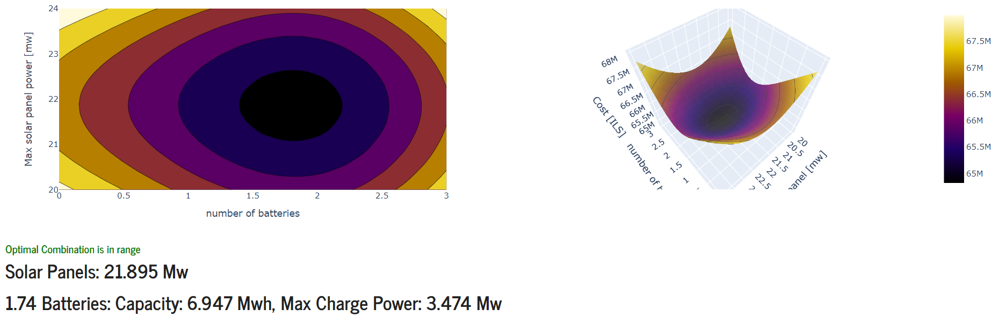
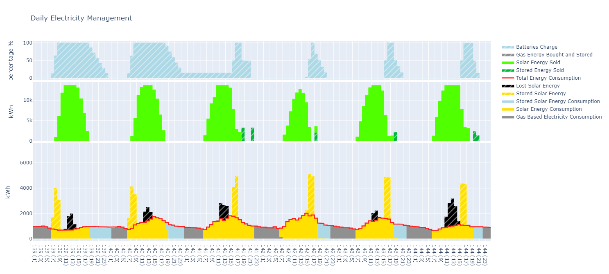

# A Thousand Suns

### Migdal David Project 2022

    

## Goals

* Simulating microgrids with solar panel and Batteries.
* Finding the optimal combination of batteries and solar panels.
* Visualizing Electric Usage and Solar Generation.

    

## Example 
* The user enters a demand profile (electrcity usage per hour) and a production profile (solar panel electricy yeild).
* The algorithm performs a grid search to find the optimal combination of of Solar Panels and Batteries to minimize costs.

 
* After finding the optimal combination the user can research how the algorithm choses to satisfy the demand and use the produced electricity.

## Electricity Usage Algorithm
Each hour, the algorithm must satisfy the demand (so there are no power outages) by:
1. Buying gas based electricity.
2. Using solar energy if available.
3. Using electricity stored in the battries if available.

Then, if there is access electricity the algorithm may:
1. Sell access solar energy back to the grid.
2. Sell access electricity from the battries back to the grid.
3. Store access solar energy in the battries if there is space left.
4. Toss it (wasted energy).

We wrote a greedy algorithm that locally minimizes the total costs of solar panels, batteries and of course electricity. By minimizing the costs per day. We can also minimize the total costs.

## Installation

    sudo apt install git python3.8 python-pip
    git clone https://github.com/RazasSapir/ThousandSuns.git
    pip install -r requirements.txt

## Usage

    python app.py

## Create Executable

    python setup.py bdist_msi 